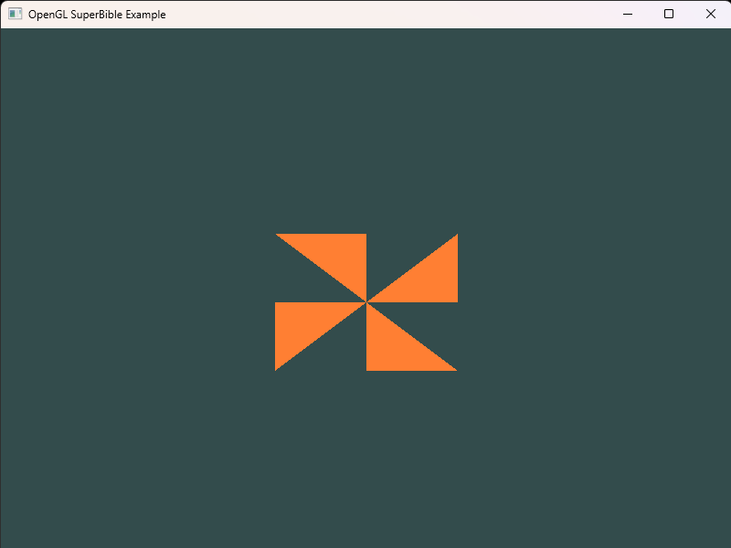

# Ex_01_DrawPoint
삼각형 4개로 바람개비를 렌더링하는 예제이다.
 

### Implementation Notes
- glDrawArrays(GL_TRIANGLES, 0, 12)로 vertex shader를 12번 실행시킨다.
- vertex shader 내부에 모든 정점의 위치를 지정한다.
- 실행 횟수에 따라 vertex ID가 증가하면서 12개의 정점 위치를 계산한다.

### Key Learning Points
- glDrawArrays(GLenum mode, GLint first, GLsizei count)의 인자는 프리미티브 종류, 시작 vertexID, 정점의 총 개수이다.
