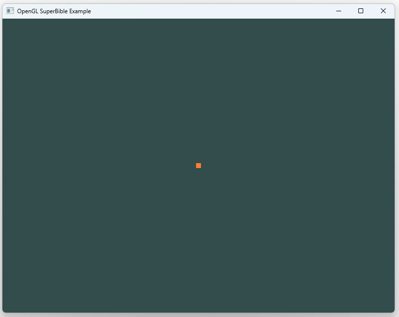

# Ex_01_DrawPoint
가장 단순한 렌더링 파이프라인을 구성하여 화면 중앙에 점(GL_POINTS)을 출력하는 예제이다.
 

### Implementation Notes
- Vertex Shader에서 gl_Position을 지정하여 하나의 정점을 생성한다.
- Fragment Shader에서 고정 색상을 출력한다.
- glDrawArrays(GL_POINTS, 0, 1)로 점을 렌더링한다.

### Key Learning Points
- Vertex Shader와 Fragment Shader의 컴파일 및 링크 과정
- 셰이더 코드를 프로그램 객체로 구성하는 기본 흐름
- glDrawArrays를 이용한 가장 단순한 Primitive 렌더링
