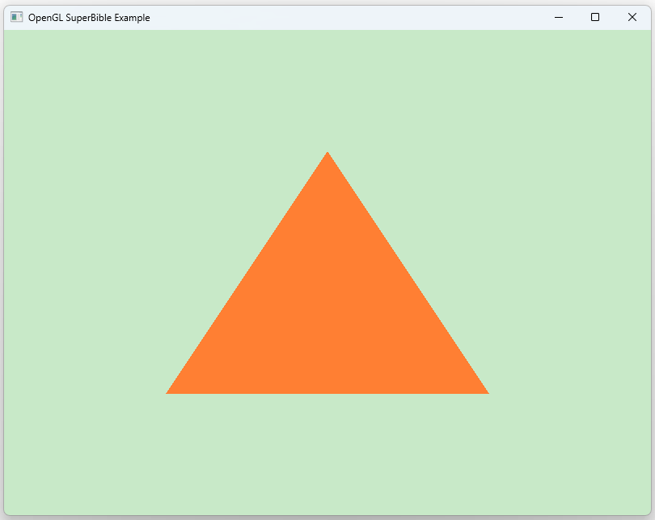

# Ex_02_DrawTriangle
가장 단순한 렌더링 파이프라인을 구성하여 화면 중앙에 하나의 삼각형(GL_TRIANGLES)을 출력하는 예제이다.
 

### Implementation Notes
- Vertex Shader 내부 배열로 정점의 위치를 정의한다.
- gl_VertexID를 인덱스로 사용하여 호출마다 gl_Position에 할당한다.
- glDrawArrays(GL_TRIANGLES, 0, 3)로 삼각형을 구성한다.
- render 함수의 currentTime을 활용하여 배경색상을 바꾼다.

### Key Learning Points
- gl_VertexID를 활용한 정점 선택의 개념
- glDrawArrays를 이용한 삼각형 렌더링 방식
